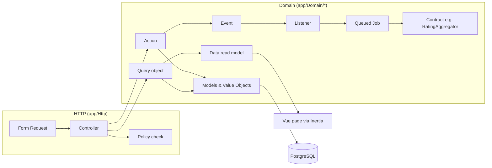

# Architecture

This document explains how Golden Court is built and, more importantly, why.
It is written for an engineer joining the project or reviewing it. Each
section is a few paragraphs; follow the links into the code for detail.

## 1. Purpose and non-goals

Golden Court is a review hub for padel courts. Players find a venue, look at
its courts, read what other players thought and leave their own review. Every
review scores a court on four dimensions (glass, lighting, turf, facilities)
plus a written body. Courts and venues carry an aggregate score that is
recalculated asynchronously. Venue owners can claim a venue and, once an admin
approves the claim, post one public reply per review. Players can flag reviews
and vote them helpful; a small admin area handles claims and flags.

The name plays on padel's *golden point*, the single point that decides a
game. The top-scoring court in a city with at least five reviews carries the
"Golden Court" badge.

Non-goals, deliberately: there is no booking, no pricing, no availability, no
calendar and no real-time anything. The project exists to demonstrate
mid-level engineering judgement inside Laravel: SOLID applied pragmatically,
strict typing across PHP and TypeScript, the database treated as part of the
domain, asynchronous aggregation, policy-based authorisation and a test suite
that documents behaviour.

## 2. Layering

Requests flow one way: HTTP → Actions → Domain. Nothing further down knows
about anything further up.



**Controllers** are single-action classes that do four things in order:
authorise via a policy, turn the validated Form Request into a Data object,
call one Action, return a response. Domain exceptions are translated into
validation errors right there (`StoreReviewController` turns
`ReviewAlreadyExistsException` into an error on `court_id`). A controller
never contains SQL or business rules.

**Actions** (`app/Domain/*/Actions`) are `final` classes with one public
`handle()` and constructor-injected dependencies. They own transactions,
translate database violations into domain exceptions, and dispatch events
after commit. Anything that can be swapped sits behind an interface in a
`Contracts` namespace and is bound in `DomainServiceProvider`: the rating
aggregator, the publication rule, the content rule, the site statistics.

**Query objects** (`app/Domain/*/Queries`) are the read side. They wrap an
Eloquent builder, take criteria objects rather than requests, and return
paginators or collections that controllers map to **Data** read models
(spatie/laravel-data). Data classes are the contract with the frontend and
the source of the generated TypeScript types.

**Bounded contexts** are folders under `app/Domain`: `Users`, `Venues`,
`Courts`, `Reviews`, `Claims`, `Moderation`, plus `Shared` for the exception
base and small contracts. Contexts talk through events and listeners where
they can. Eloquent models live in their context, not in `app/Models`.

## 3. Value objects and enums

Domain concepts with rules are `final readonly` value objects that validate in
a static constructor and throw a domain exception: `Rating` (1–5),
`CourtScores` (four ratings with a derived overall), `AggregateScore` (0.0–5.0
with a review count, and a rule that a non-zero score needs at least one
review), `Coordinates` (WGS84 bounds and a haversine distance). They depend on
nothing from Laravel, so they are unit-tested with plain Pest.

The value objects reach the database through two Eloquent casts.
`RatingCast` maps an integer column to a `Rating` and refuses to write an
out-of-range integer, so a bad value is caught before the `CHECK` constraint
would. `CoordinatesCast` is a two-column cast: it reads a virtual
`coordinates` attribute from the `latitude` and `longitude` columns and, on
write, returns an array so Eloquent updates both.

Enums are backed PHP enums that implement a small `HasLabel` contract so the
UI can render them generically (`OptionData::fromEnum()`). They are stored as
plain string columns, never PostgreSQL enum types, which are painful to
alter. Instead each enum column gets a `CHECK (col IN (...))` generated from
the PHP cases by `App\Support\Database\CheckConstraint::enum()`, so the list
of allowed values is defined exactly once. Adding a case means a migration,
and forgetting the migration fails a constraint test, not production.

## 4. The database as the last line of defence

Rules that must hold regardless of which code path wrote the row are
enforced by PostgreSQL and then tested: one review per user per court
(unique index), ratings between 1 and 5 and bodies between 20 and 2000
characters (`CHECK`), one pending claim per venue (a partial unique index
`WHERE status = 'pending'`), one reply per review (unique), one flag and one
vote per user per review (unique), score and count ranges on courts and
venues. Every constraint has a Pest test asserting the SQLSTATE (`23505` for
unique, `23514` for check) rather than message text.

Policies duplicate some of these as UX pre-checks so a player sees a friendly
403 instead of a 500, but the Actions do not trust them. Each risky insert
runs inside a nested `DB::transaction()`, which PostgreSQL treats as a
savepoint, so a `UniqueConstraintViolationException` can be caught and
re-thrown as a domain exception (`ReviewAlreadyExistsException`,
`ClaimAlreadyPendingException`, `ReplyAlreadyExistsException`,
`AlreadyFlaggedException`) without poisoning the outer transaction. A test
proves the database path by soft-deleting a review, which the policy cannot
see but which still occupies the unique index.

## 5. Aggregation

Scores are denormalised onto `courts.aggregate_score`/`review_count` and
`venues.aggregate_score`/`review_count`. They are written only by two jobs.

```
Action → afterCommit → ReviewSubmitted | ReviewUpdated | ReviewDeleted | ReviewStatusChanged
       → QueueScoreRecalculation (listener) → RecalculateCourtScore (job, unique per court)
       → RatingAggregator contract → single UPDATE → RecalculateVenueScore (job)
```

`RecalculateCourtScore` loads the court's published reviews as `CourtScores`,
hands them to whatever `RatingAggregator` is bound, and writes the result
with a plain `UPDATE` so `updated_at` is not touched by a background
recompute. It then busts the Golden Court cache for the city and dispatches
the venue job, which computes the review-count-weighted mean of the venue's
courts. Both jobs implement `ShouldBeUnique`, so a burst of edits queues one
recalculation.

Two aggregators exist. `SimpleAverageAggregator` is the mean of overalls.
`BayesianAggregator` computes `(C × m + Σ overall) / (C + n)` where `m` is
the site-wide mean from the `SiteStatistics` contract (cached ten minutes)
and `C` is `golden_court.aggregation.bayesian_confidence` (default 5). With
few reviews a court is pulled towards the site mean, so one 5-star review
cannot outrank twenty 4.6-star reviews; with `C = 0` it equals the simple
mean. Bayesian is the default. Switching is configuration only:

```sh
GOLDEN_COURT_AGGREGATION=simple   # or bayesian
php artisan golden-court:recalculate-scores   # re-queues every court
```

The test suite pins the strategy to `simple` so its exact-mean assertions
stay readable; the Bayesian aggregator has its own tests, and one test
switches strategy and runs the command synchronously to prove scores change
with no code change.

## 6. Search and geo

Text search uses a generated `tsvector` column on `venues`
(`to_tsvector('english', name || ' ' || city)`, `STORED`) with a GIN index,
queried through `plainto_tsquery` and ranked with `ts_rank` as a tiebreak.

Proximity uses the contrib `cube` and `earthdistance` extensions rather than
PostGIS. They ship with every PostgreSQL build including the `postgres:17` CI
image, great-circle distance is all the product needs, and it avoids a
heavier dependency. A functional GiST index on
`ll_to_earth(latitude, longitude)` answers the bounding-box predicate
`earth_box(point, radius) @> ll_to_earth(...)`; the exact `earth_distance`
check then trims the box's corners and is also selected as `distance_km`.

`VenueSearchQuery` composes term, city, proximity, court-attribute filters
(via `whereHas`), minimum score and four sorts from a `VenueSearchCriteria`
Data object. `docs/notes/query-plans.md` holds `EXPLAIN (ANALYZE, BUFFERS)`
output from a 5,000-row table showing the GiST index used for proximity and
the GIN index used for selective terms; for a single common word matching
6% of a small table the planner correctly prefers a sequential scan.

## 7. Authorisation

Users have one `Role`: `player`, `venue_owner` or `admin`. Policies are the
single place where "who may do what" lives, registered in
`DomainServiceProvider`:

- `ReviewPolicy`: players and admins with an account older than
  `golden_court.reviews.min_account_age_hours` may review a court they have
  not reviewed; owners may edit while pending or published; owners or admins
  may delete; verified users other than the author may vote or flag a
  published review once; only admins change status.
- `ReviewReplyPolicy`: the owner of the venue the review is about (or an
  admin) may reply once to a published review; the reply's author or an
  admin may edit or delete it.
- `VenueClaimPolicy`: any signed-in user may claim an unclaimed venue;
  admins review claims.

The venue-owner scope is the row itself: `venues.claimed_by_user_id` is set
by `ReviewVenueClaimAction` on approval, which also promotes a player to
`venue_owner` in the same transaction. Moderation actions take a
`ModerationActor` (a `User` or the `SystemActor` null object used when three
flags escalate a review automatically), and every decision is written to the
append-only `moderation_logs` table and mirrored to the application log.

The `/admin` routes sit behind an `admin` middleware alias as well as the
policies, so a non-admin gets a 403 before any controller runs.

## 8. Type safety across the stack

Every PHP file declares `strict_types`. Larastan runs at level 8 over `app/`,
`database/`, `routes/` and `tests/` with zero errors and no ignore comments.
Eloquent models carry `@property` docblocks because Larastan does not read
`casts()` for custom or enum casts.

Data classes and the `Coordinates` value object are annotated `#[TypeScript]`
and, together with every domain enum, are transformed by
spatie/laravel-typescript-transformer into `resources/js/types/generated.d.ts`.
Vue pages type their props with aliases of those generated types
(`resources/js/types/models.ts`); nothing in `resources/js` hand-writes a type
that mirrors a PHP Data class. The generated file is committed so the
frontend can type-check without PHP, and CI regenerates it and fails on
`git diff --exit-code` if it is stale. Renaming a property on a Data class
therefore fails `npm run check` until the Vue that uses it is updated.

TypeScript is `strict` with `noUncheckedIndexedAccess` and
`noImplicitOverride`. The one `any` in the codebase is a Vitest interface
augmentation whose type parameter default must match Vitest's own.

## 9. Testing strategy

Tests run against PostgreSQL only; the suite refuses to fall back to SQLite.
Each layer's tests prove something specific:

- **Unit** (`tests/Unit`): value objects, enums, aggregators and the content
  rule, with boundary cases. Pure PHP, no container.
- **Constraint tests** (`tests/Feature/Database`): every `CHECK` and `UNIQUE`
  fires, asserted on SQLSTATE; indexes exist; pruning removes exactly what
  the retention windows say.
- **Action tests**: happy paths, every domain exception path, events
  dispatched (`Event::fake()` scoped to the domain events so Eloquent model
  events still run), and audit-log entries written.
- **Job and listener tests**: the recalculation pipeline, including a stub
  aggregator bound in the container to prove the abstraction is real.
- **Policy tests**: every ability, allowed and forbidden.
- **HTTP tests**: each route renders the right Inertia component with the
  right props, validation failures, 403s, 404s for scoped bindings, rate
  limits, and two end-to-end flows (claim → approve → reply; three flags →
  hidden → admin settles).
- **Performance tests**: query counts on the discovery pages, with
  `Model::shouldBeStrict()` turning any lazy load into a failure.
- **Frontend** (Vitest via vite-plus, jsdom): `RatingInput` keyboard and ARIA
  behaviour, `RatingStars`, `ScoreBadge`, the `useVenueSearch` composable,
  and axe-core checks on the shared components.

## 10. Known limitations and scale

At today's size a single PostgreSQL instance does everything, and that is
the right call. Things that would change at 100× the traffic:

- **Read replicas** for the discovery pages, which are read-heavy and
  tolerate slightly stale scores. Laravel's read/write connection split
  makes this a configuration change.
- **A search service** if full-text needs typo tolerance, facets or
  multi-language stemming beyond what `tsvector` offers. The
  `VenueSearchQuery` boundary is where it would plug in.
- **Materialised views or a summary table** for per-city leaderboards and
  the Golden Court, replacing the per-city cache with a nightly refresh.
- **Queue backend**: the `database` queue driver is fine for one worker;
  Redis would replace it before adding more.

Limitations worth knowing about now: the unique index on
`(user_id, court_id)` includes soft-deleted rows, so a player who deletes a
review cannot review that court again until the row is pruned (a partial
index `WHERE deleted_at IS NULL` would change that); email verification is
the only identity signal; the content rule is intentionally naive; and
observability is logs plus the `failed_jobs` table rather than a dashboard
(Laravel Pulse was considered and skipped as the heavier option).
